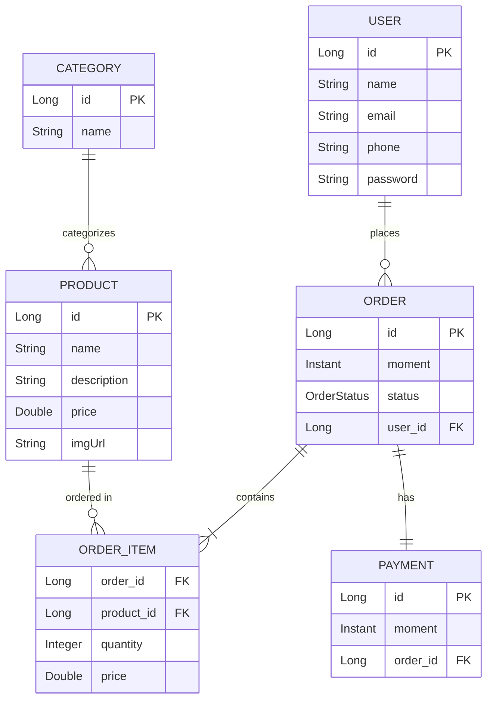

<div align="center">

# 🚀 Workshop Spring Boot 4

### Complete Web System built with Spring Boot 4 + JPA/Hibernate

[](https://spring.io/projects/spring-boot)
[](https://www.oracle.com/java/)
[](https://maven.apache.org/)
[](https://www.postgresql.org/)
[](LICENSE)

[About](#-about-the-project) •
[Technologies](#-technologies) •
[Architecture](#-architecture) •
[Installation](#-installation) •
[Usage](#-usage) •
[API](#-api-endpoints) •
[Author](#-author)

</div>

---

## 📋 About the Project

This project is a complete web application developed during a **Spring Boot 4** workshop, implementing an enterprise management system focused on **layered architecture**, **development best practices**, and **design patterns**.

The system implements complete **CRUD operations**, entity relationships, custom exception handling, and robust validations, providing a solid foundation for enterprise applications.

### ✨ Key Features

- ✅ **Complete CRUD** - Create, Read, Update, and Delete operations
- ✅ **JPA Relationships** - OneToMany, ManyToOne, ManyToMany with bidirectional mapping
- ✅ **Exception Handling** - Robust error handling system
- ✅ **Data Validation** - Bean Validation with custom messages
- ✅ **RESTful API** - Endpoints following REST standards
- ✅ **Database** - PostgreSQL with JPA/Hibernate
- ✅ **Profiles** - Configurations for development and production
- ✅ **Tests** - Unit and integration tests

---

## 🛠 Technologies

This project was developed using the following cutting-edge technologies:

<div align="center">

| Technology | Version | Description |
|------------|---------|-------------|
|  | 17+ | Programming language |
|  | 4.0 | Java framework |
|  | 3.8+ | Dependency manager |
|  | 13+ | Relational database |
|  | 6.x | ORM (Object-Relational Mapping) |
|  | - | In-memory database for testing |

</div>

### 📦 Main Dependencies

```xml
<!-- Spring Boot Starter Web -->
<dependency>
    <groupId>org.springframework.boot</groupId>
    <artifactId>spring-boot-starter-web</artifactId>
</dependency>

<!-- Spring Boot Starter Data JPA -->
<dependency>
    <groupId>org.springframework.boot</groupId>
    <artifactId>spring-boot-starter-data-jpa</artifactId>
</dependency>

<!-- PostgreSQL Driver -->
<dependency>
    <groupId>org.postgresql</groupId>
    <artifactId>postgresql</artifactId>
    <scope>runtime</scope>
</dependency>

<!-- H2 Database (Test) -->
<dependency>
    <groupId>com.h2database</groupId>
    <artifactId>h2</artifactId>
    <scope>runtime</scope>
</dependency>
```

---

## 🏗 Architecture

The project follows the **Layered Architecture**, promoting separation of concerns and high cohesion:

```
┌─────────────────────────────────────────────┐
│         PRESENTATION LAYER                  │
│            (Controllers)                    │
│   - UserController                          │
│   - OrderController                         │
│   - ProductController                       │
└──────────────────┬──────────────────────────┘
                   │
                   ▼
┌─────────────────────────────────────────────┐
│          SERVICE LAYER                      │
│            (Services)                       │
│   - UserService                             │
│   - OrderService                            │
│   - ProductService                          │
└──────────────────┬──────────────────────────┘
                   │
                   ▼
┌─────────────────────────────────────────────┐
│          PERSISTENCE LAYER                  │
│           (Repositories)                    │
│   - UserRepository                          │
│   - OrderRepository                         │
│   - ProductRepository                       │
└──────────────────┬──────────────────────────┘
                   │
                   ▼
┌─────────────────────────────────────────────┐
│          DOMAIN LAYER                       │
│            (Entities)                       │
│   - User                                    │
│   - Order                                   │
│   - Product                                 │
│   - Category                                │
│   - OrderItem                               │
└─────────────────────────────────────────────┘
```

### 📂 Directory Structure

```
workshop-springboot4/
├── 📁 src/
│   ├── 📁 main/
│   │   ├── 📁 java/
│   │   │   └── 📁 com/joaoguilhermmy/workshop/
│   │   │       ├── 📁 config/          # Application configurations
│   │   │       │   ├── TestConfig.java
│   │   │       │   └── DevConfig.java
│   │   │       │
│   │   │       ├── 📁 controllers/     # REST Layer (Presentation)
│   │   │       │   ├── UserController.java
│   │   │       │   ├── OrderController.java
│   │   │       │   ├── ProductController.java
│   │   │       │   └── CategoryController.java
│   │   │       │
│   │   │       ├── 📁 services/        # Business Logic
│   │   │       │   ├── UserService.java
│   │   │       │   ├── OrderService.java
│   │   │       │   ├── ProductService.java
│   │   │       │   └── CategoryService.java
│   │   │       │
│   │   │       ├── 📁 repositories/    # Data Access (JPA)
│   │   │       │   ├── UserRepository.java
│   │   │       │   ├── OrderRepository.java
│   │   │       │   ├── ProductRepository.java
│   │   │       │   ├── CategoryRepository.java
│   │   │       │   └── OrderItemRepository.java
│   │   │       │
│   │   │       ├── 📁 entities/        # Domain Model
│   │   │       │   ├── User.java
│   │   │       │   ├── Order.java
│   │   │       │   ├── Product.java
│   │   │       │   ├── Category.java
│   │   │       │   ├── OrderItem.java
│   │   │       │   └── 📁 enums/
│   │   │       │       └── OrderStatus.java
│   │   │       │
│   │   │       ├── 📁 exceptions/      # Exception Handling
│   │   │       │   ├── ResourceNotFoundException.java
│   │   │       │   ├── DatabaseException.java
│   │   │       │   └── ControllerExceptionHandler.java
│   │   │       │
│   │   │       └── WorkshopApplication.java  # Main Class
│   │   │
│   │   └── 📁 resources/
│   │       ├── application.properties
│   │       ├── application-test.properties
│   │       └── application-dev.properties
│   │
│   └── 📁 test/                       # Tests
│       └── 📁 java/
│
├── 📄 pom.xml                         # Maven Dependencies
├── 📄 script.sql                      # Database Scripts
├── 📄 .gitignore
└── 📄 README.md
```

---

## 🔗 Relationship Diagram

The system implements the following entity relationships:



### 🔄 Implemented Relationships

1. **User → Order** (OneToMany)
   - A user can have multiple orders
   - Bidirectional mapping with `@JsonIgnore` to avoid circular reference

2. **Order → OrderItem** (OneToMany)
   - An order contains multiple items
   - Composite key in OrderItem

3. **Product → OrderItem** (OneToMany)
   - A product can be in several orders
   - Relationship through OrderItem

4. **Category → Product** (ManyToMany)
   - Products can have multiple categories
   - Categories can contain multiple products
   - Association table `tb_product_category`

5. **Order → Payment** (OneToOne)
   - An order has one payment
   - Optional relationship with cascade mapping

---

## 💻 Installation

### Prerequisites

Before starting, make sure you have installed on your machine:

- ☕ **Java JDK 17** or higher
- 📦 **Maven 3.8+**
- 🐘 **PostgreSQL 13+**
- 🔧 **IDE** (IntelliJ IDEA, Eclipse, VS Code)

### 🚀 Step by Step

1️⃣ **Clone the repository**
```bash
git clone https://github.com/JoaoGuilhermmy/workshop-springboot4.git
cd workshop-springboot4
```

2️⃣ **Configure the database**

Create a PostgreSQL database:
```sql
CREATE DATABASE workshop_db;
```

3️⃣ **Configure credentials**

Edit the file `src/main/resources/application-dev.properties`:
```properties
spring.datasource.url=jdbc:postgresql://localhost:5432/workshop_db
spring.datasource.username=your_username
spring.datasource.password=your_password

spring.jpa.hibernate.ddl-auto=update
spring.jpa.show-sql=true
spring.jpa.properties.hibernate.format_sql=true
```

4️⃣ **Run the SQL script**
```bash
psql -U your_username -d workshop_db -f script.sql
```

5️⃣ **Compile the project**
```bash
mvn clean install
```

6️⃣ **Run the application**
```bash
mvn spring-boot:run
```

The application will be available at: **http://localhost:8080**

---

## 📡 API Endpoints

### 👤 Users

| Method | Endpoint | Description |
|--------|----------|-------------|
| `GET` | `/users` | List all users |
| `GET` | `/users/{id}` | Get user by ID |
| `POST` | `/users` | Create new user |
| `PUT` | `/users/{id}` | Update existing user |
| `DELETE` | `/users/{id}` | Delete user |

**POST Request Example:**
```json
{
  "name": "João Guilhermmy",
  "email": "joaoguilherrmmy@gmail.com",
  "phone": "84999999999",
  "password": "123456"
}
```

### 📦 Orders

| Method | Endpoint | Description |
|--------|----------|-------------|
| `GET` | `/orders` | List all orders |
| `GET` | `/orders/{id}` | Get order by ID |
| `POST` | `/orders` | Create new order |

**GET /orders/{id} Response:**
```json
{
  "id": 1,
  "moment": "2024-01-20T19:53:07Z",
  "orderStatus": "PAID",
  "client": {
    "id": 1,
    "name": "João Guilhermmy",
    "email": "joaoguilherrmmy@gmail.com"
  },
  "items": [
    {
      "product": {
        "id": 1,
        "name": "The Lord of the Rings",
        "price": 90.5
      },
      "quantity": 2,
      "price": 90.5,
      "subTotal": 181.0
    }
  ],
  "payment": {
    "id": 1,
    "moment": "2024-01-20T21:53:07Z"
  },
  "total": 181.0
}
```

### 🛍 Products

| Method | Endpoint | Description |
|--------|----------|-------------|
| `GET` | `/products` | List all products |
| `GET` | `/products/{id}` | Get product by ID |
| `POST` | `/products` | Create new product |
| `PUT` | `/products/{id}` | Update product |
| `DELETE` | `/products/{id}` | Delete product |

### 📑 Categories

| Method | Endpoint | Description |
|--------|----------|-------------|
| `GET` | `/categories` | List all categories |
| `GET` | `/categories/{id}` | Get category by ID |

---

## 🧪 Testing

The project uses **JUnit 5** and **Spring Boot Test** for testing:

```bash
# Run all tests
mvn test

# Run tests with coverage
mvn test jacoco:report
```

### 🎯 Test Profiles

- **test**: Uses H2 Database in memory
- **dev**: PostgreSQL for development
- **prod**: PostgreSQL for production

To change the active profile:
```properties
spring.profiles.active=test
```

---

## 🔧 Advanced Configurations

### Spring Profiles

The project supports multiple environments:

**application.properties** (Main)
```properties
spring.profiles.active=test
spring.jpa.open-in-view=true
```

**application-test.properties** (Testing)
```properties
spring.datasource.url=jdbc:h2:mem:testdb
spring.datasource.username=sa
spring.datasource.password=

spring.h2.console.enabled=true
spring.h2.console.path=/h2-console

spring.jpa.show-sql=true
spring.jpa.properties.hibernate.format_sql=true
```

**application-dev.properties** (Development)
```properties
spring.datasource.url=jdbc:postgresql://localhost:5432/workshop_db
spring.datasource.username=postgres
spring.datasource.password=postgres

spring.jpa.hibernate.ddl-auto=update
spring.jpa.show-sql=true
spring.jpa.properties.hibernate.format_sql=true
```

---

## 🎓 Applied Concepts

### Design Patterns

- ✅ **Repository Pattern** - Data layer abstraction
- ✅ **Service Layer Pattern** - Centralized business logic
- ✅ **DTO Pattern** - Optimized data transfer
- ✅ **Dependency Injection** - Inversion of control
- ✅ **Exception Handler** - Centralized error handling

### Best Practices

- ✅ Clean and readable code
- ✅ Standardized naming
- ✅ Separation of concerns
- ✅ DRY (Don't Repeat Yourself)
- ✅ SOLID principles
- ✅ RESTful API standards

---

## 📊 Data Model

### Main Entities

**User**
```java
- id: Long
- name: String
- email: String
- phone: String
- password: String
- orders: List<Order>
```

**Order**
```java
- id: Long
- moment: Instant
- orderStatus: OrderStatus
- client: User
- items: Set<OrderItem>
- payment: Payment
```

**Product**
```java
- id: Long
- name: String
- description: String
- price: Double
- imgUrl: String
- categories: Set<Category>
```

**Category**
```java
- id: Long
- name: String
- products: Set<Product>
```

**OrderItem**
```java
- id: OrderItemPK
- quantity: Integer
- price: Double
```

**Payment**
```java
- id: Long
- moment: Instant
- order: Order
```

---

## 🐛 Exception Handling

The system implements **robust exception handling** with standardized responses:

### Custom Exceptions

```java
@ControllerAdvice
public class ControllerExceptionHandler {
    
    @ExceptionHandler(ResourceNotFoundException.class)
    public ResponseEntity<StandardError> resourceNotFound(
        ResourceNotFoundException e, HttpServletRequest request) {
        
        String error = "Resource not found";
        HttpStatus status = HttpStatus.NOT_FOUND;
        StandardError err = new StandardError(
            Instant.now(), 
            status.value(), 
            error, 
            e.getMessage(), 
            request.getRequestURI()
        );
        return ResponseEntity.status(status).body(err);
    }
    
    @ExceptionHandler(DatabaseException.class)
    public ResponseEntity<StandardError> database(
        DatabaseException e, HttpServletRequest request) {
        
        String error = "Database error";
        HttpStatus status = HttpStatus.BAD_REQUEST;
        StandardError err = new StandardError(
            Instant.now(), 
            status.value(), 
            error, 
            e.getMessage(), 
            request.getRequestURI()
        );
        return ResponseEntity.status(status).body(err);
    }
}
```

### Standardized Error Response

```json
{
  "timestamp": "2024-01-20T19:53:07.000+00:00",
  "status": 404,
  "error": "Resource not found",
  "message": "Entity not found with id: 999",
  "path": "/users/999"
}
```

---

## 🚀 Deployment

### Docker (Optional)

Create a `Dockerfile`:

```dockerfile
FROM openjdk:17-jdk-slim
WORKDIR /app
COPY target/*.jar app.jar
EXPOSE 8080
ENTRYPOINT ["java", "-jar", "app.jar"]
```

Build and run:
```bash
docker build -t workshop-springboot4 .
docker run -p 8080:8080 workshop-springboot4
```

---

## 📝 Development Notes

### Future Improvements

- [ ] Implement JWT authentication
- [ ] Add Spring Security
- [ ] Create Swagger/OpenAPI documentation
- [ ] Implement cache with Redis
- [ ] Add integration tests
- [ ] Create administrative dashboard
- [ ] Implement pagination in endpoints
- [ ] Add more robust validations
- [ ] Create structured logging system
- [ ] Implement audit trail

---

## 👨‍💻 Author

<div align="center">
  
  
  ### João Guilhermmy
  
  💼 Java Developer | Spring Boot Enthusiast
  
  [](https://www.linkedin.com/in/joão-guilhermmy-93661b29b)
  [](mailto:joaoguilherrmmy@gmail.com)
  [](https://github.com/JoaoGuilhermmy)
  
  📧 **Email:** joaoguilherrmmy@gmail.com
  
  🔗 **LinkedIn:** [linkedin.com/in/joão-guilhermmy-93661b29b](https://www.linkedin.com/in/joão-guilhermmy-93661b29b)
  
</div>

---

## 📄 License

This project is under the MIT license. See the [LICENSE](LICENSE) file for more details.

---

## 🙏 Acknowledgments

- [Spring Framework Team](https://spring.io/)
- [Hibernate Team](https://hibernate.org/)
- Java/Spring Boot Community
- All open-source contributors

---

<div align="center">
  
  **⭐ If this project was useful to you, consider giving it a star!**
  
  Developed with ❤️ by [João Guilhermmy](https://github.com/JoaoGuilhermmy)
  
  
  
  
</div>
