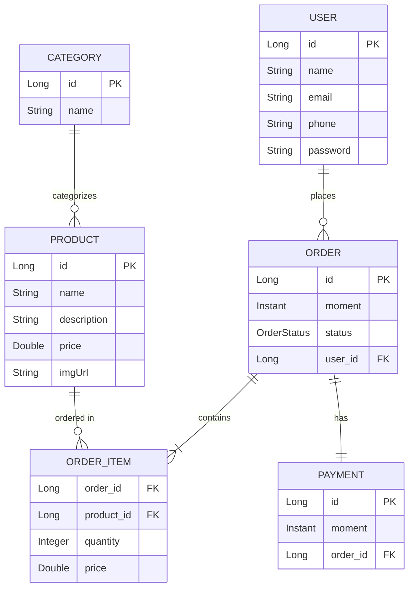

<div align="center">

# 🚀 Workshop Spring Boot 4

### Sistema Web completo desenvolvido com Spring Boot 4 + JPA/Hibernate

[](https://spring.io/projects/spring-boot)
[](https://www.oracle.com/java/)
[](https://maven.apache.org/)
[](https://www.postgresql.org/)
[](LICENSE)

[Sobre](#-sobre-o-projeto) •
[Tecnologias](#-tecnologias) •
[Arquitetura](#-arquitetura) •
[Instalação](#-instalação) •
[Uso](#-uso) •
[API](#-endpoints-da-api) •
[Autor](#-autor)

</div>

---

## 📋 Sobre o Projeto

Este projeto é uma aplicação web completa desenvolvida durante um workshop de **Spring Boot 4**, implementando um sistema de gerenciamento empresarial com foco em **arquitetura em camadas**, **boas práticas de desenvolvimento** e **design patterns**.

O sistema implementa operações **CRUD completas**, relacionamentos entre entidades, tratamento de exceções personalizado e validações robustas, proporcionando uma base sólida para aplicações empresariais.

### ✨ Funcionalidades Principais

- ✅ **CRUD Completo** - Operações de criação, leitura, atualização e exclusão
- ✅ **Relacionamentos JPA** - OneToMany, ManyToOne, ManyToMany com mapeamento bidirecional
- ✅ **Tratamento de Exceções** - Sistema robusto de tratamento de erros
- ✅ **Validação de Dados** - Bean Validation com mensagens personalizadas
- ✅ **API RESTful** - Endpoints seguindo padrões REST
- ✅ **Banco de Dados** - PostgreSQL com JPA/Hibernate
- ✅ **Profiles** - Configurações para desenvolvimento e produção
- ✅ **Testes** - Unitários e de integração

---

## 🛠 Tecnologias

Este projeto foi desenvolvido utilizando as seguintes tecnologias de ponta:

<div align="center">

| Tecnologia | Versão | Descrição |
|------------|--------|-----------|
|  | 17+ | Linguagem de programação |
|  | 4.0 | Framework Java |
|  | 3.8+ | Gerenciador de dependências |
|  | 13+ | Banco de dados relacional |
|  | 6.x | ORM (Object-Relational Mapping) |
|  | - | Banco em memória para testes |

</div>

### 📦 Dependências Principais

```xml
<!-- Spring Boot Starter Web -->
<dependency>
    <groupId>org.springframework.boot</groupId>
    <artifactId>spring-boot-starter-web</artifactId>
</dependency>

<!-- Spring Boot Starter Data JPA -->
<dependency>
    <groupId>org.springframework.boot</groupId>
    <artifactId>spring-boot-starter-data-jpa</artifactId>
</dependency>

<!-- PostgreSQL Driver -->
<dependency>
    <groupId>org.postgresql</groupId>
    <artifactId>postgresql</artifactId>
    <scope>runtime</scope>
</dependency>

<!-- H2 Database (Test) -->
<dependency>
    <groupId>com.h2database</groupId>
    <artifactId>h2</artifactId>
    <scope>runtime</scope>
</dependency>
```

---

## 🏗 Arquitetura

O projeto segue a **arquitetura em camadas** (Layered Architecture), promovendo separação de responsabilidades e alta coesão:

```
┌─────────────────────────────────────────────┐
│          CAMADA DE APRESENTAÇÃO             │
│              (Controllers)                  │
│   - UserController                          │
│   - OrderController                         │
│   - ProductController                       │
└──────────────────┬──────────────────────────┘
                   │
                   ▼
┌─────────────────────────────────────────────┐
│          CAMADA DE SERVIÇO                  │
│              (Services)                     │
│   - UserService                             │
│   - OrderService                            │
│   - ProductService                          │
└──────────────────┬──────────────────────────┘
                   │
                   ▼
┌─────────────────────────────────────────────┐
│          CAMADA DE PERSISTÊNCIA             │
│            (Repositories)                   │
│   - UserRepository                          │
│   - OrderRepository                         │
│   - ProductRepository                       │
└──────────────────┬──────────────────────────┘
                   │
                   ▼
┌─────────────────────────────────────────────┐
│          CAMADA DE DOMÍNIO                  │
│             (Entities)                      │
│   - User                                    │
│   - Order                                   │
│   - Product                                 │
│   - Category                                │
│   - OrderItem                               │
└─────────────────────────────────────────────┘
```

### 📂 Estrutura de Diretórios

```
workshop-springboot4/
├── 📁 src/
│   ├── 📁 main/
│   │   ├── 📁 java/
│   │   │   └── 📁 com/joaoguilhermmy/workshop/
│   │   │       ├── 📁 config/          # Configurações da aplicação
│   │   │       │   ├── TestConfig.java
│   │   │       │   └── DevConfig.java
│   │   │       │
│   │   │       ├── 📁 controllers/     # Camada REST (Apresentação)
│   │   │       │   ├── UserController.java
│   │   │       │   ├── OrderController.java
│   │   │       │   ├── ProductController.java
│   │   │       │   └── CategoryController.java
│   │   │       │
│   │   │       ├── 📁 services/        # Lógica de Negócio
│   │   │       │   ├── UserService.java
│   │   │       │   ├── OrderService.java
│   │   │       │   ├── ProductService.java
│   │   │       │   └── CategoryService.java
│   │   │       │
│   │   │       ├── 📁 repositories/    # Acesso a Dados (JPA)
│   │   │       │   ├── UserRepository.java
│   │   │       │   ├── OrderRepository.java
│   │   │       │   ├── ProductRepository.java
│   │   │       │   ├── CategoryRepository.java
│   │   │       │   └── OrderItemRepository.java
│   │   │       │
│   │   │       ├── 📁 entities/        # Modelo de Domínio
│   │   │       │   ├── User.java
│   │   │       │   ├── Order.java
│   │   │       │   ├── Product.java
│   │   │       │   ├── Category.java
│   │   │       │   ├── OrderItem.java
│   │   │       │   └── 📁 enums/
│   │   │       │       └── OrderStatus.java
│   │   │       │
│   │   │       ├── 📁 exceptions/      # Tratamento de Exceções
│   │   │       │   ├── ResourceNotFoundException.java
│   │   │       │   ├── DatabaseException.java
│   │   │       │   └── ControllerExceptionHandler.java
│   │   │       │
│   │   │       └── WorkshopApplication.java  # Classe Principal
│   │   │
│   │   └── 📁 resources/
│   │       ├── application.properties
│   │       ├── application-test.properties
│   │       └── application-dev.properties
│   │
│   └── 📁 test/                       # Testes
│       └── 📁 java/
│
├── 📄 pom.xml                         # Dependências Maven
├── 📄 script.sql                      # Scripts do Banco de Dados
├── 📄 .gitignore
└── 📄 README.md
```

---

## 🔗 Diagrama de Relacionamentos

O sistema implementa os seguintes relacionamentos entre entidades:



### 🔄 Relacionamentos Implementados

1. **User → Order** (OneToMany)
   - Um usuário pode ter múltiplos pedidos
   - Mapeamento bidirecional com `@JsonIgnore` para evitar referência circular

2. **Order → OrderItem** (OneToMany)
   - Um pedido contém múltiplos itens
   - Chave composta no OrderItem

3. **Product → OrderItem** (OneToMany)
   - Um produto pode estar em vários pedidos
   - Relacionamento através de OrderItem

4. **Category → Product** (ManyToMany)
   - Produtos podem ter múltiplas categorias
   - Categorias podem conter múltiplos produtos
   - Tabela de associação `tb_product_category`

5. **Order → Payment** (OneToOne)
   - Um pedido possui um pagamento
   - Relacionamento opcional com mapeamento em cascata

---

## 💻 Instalação

### Pré-requisitos

Antes de começar, certifique-se de ter instalado em sua máquina:

- ☕ **Java JDK 17** ou superior
- 📦 **Maven 3.8+**
- 🐘 **PostgreSQL 13+**
- 🔧 **IDE** (IntelliJ IDEA, Eclipse, VS Code)

### 🚀 Passo a Passo

1️⃣ **Clone o repositório**
```bash
git clone https://github.com/JoaoGuilhermmy/workshop-springboot4.git
cd workshop-springboot4
```

2️⃣ **Configure o banco de dados**

Crie um banco de dados PostgreSQL:
```sql
CREATE DATABASE workshop_db;
```

3️⃣ **Configure as credenciais**

Edite o arquivo `src/main/resources/application-dev.properties`:
```properties
spring.datasource.url=jdbc:postgresql://localhost:5432/workshop_db
spring.datasource.username=seu_usuario
spring.datasource.password=sua_senha

spring.jpa.hibernate.ddl-auto=update
spring.jpa.show-sql=true
spring.jpa.properties.hibernate.format_sql=true
```

4️⃣ **Execute o script SQL**
```bash
psql -U seu_usuario -d workshop_db -f script.sql
```

5️⃣ **Compile o projeto**
```bash
mvn clean install
```

6️⃣ **Execute a aplicação**
```bash
mvn spring-boot:run
```

A aplicação estará disponível em: **http://localhost:8080**

---

## 📡 Endpoints da API

### 👤 Usuários

| Método | Endpoint | Descrição |
|--------|----------|-----------|
| `GET` | `/users` | Lista todos os usuários |
| `GET` | `/users/{id}` | Busca usuário por ID |
| `POST` | `/users` | Cria novo usuário |
| `PUT` | `/users/{id}` | Atualiza usuário existente |
| `DELETE` | `/users/{id}` | Remove usuário |

**Exemplo de requisição POST:**
```json
{
  "name": "João Guilhermmy",
  "email": "joaoguilherrmmy@gmail.com",
  "phone": "84999999999",
  "password": "123456"
}
```

### 📦 Pedidos

| Método | Endpoint | Descrição |
|--------|----------|-----------|
| `GET` | `/orders` | Lista todos os pedidos |
| `GET` | `/orders/{id}` | Busca pedido por ID |
| `POST` | `/orders` | Cria novo pedido |

**Resposta GET /orders/{id}:**
```json
{
  "id": 1,
  "moment": "2024-01-20T19:53:07Z",
  "orderStatus": "PAID",
  "client": {
    "id": 1,
    "name": "João Guilhermmy",
    "email": "joaoguilherrmmy@gmail.com"
  },
  "items": [
    {
      "product": {
        "id": 1,
        "name": "The Lord of the Rings",
        "price": 90.5
      },
      "quantity": 2,
      "price": 90.5,
      "subTotal": 181.0
    }
  ],
  "payment": {
    "id": 1,
    "moment": "2024-01-20T21:53:07Z"
  },
  "total": 181.0
}
```

### 🛍 Produtos

| Método | Endpoint | Descrição |
|--------|----------|-----------|
| `GET` | `/products` | Lista todos os produtos |
| `GET` | `/products/{id}` | Busca produto por ID |
| `POST` | `/products` | Cria novo produto |
| `PUT` | `/products/{id}` | Atualiza produto |
| `DELETE` | `/products/{id}` | Remove produto |

### 📑 Categorias

| Método | Endpoint | Descrição |
|--------|----------|-----------|
| `GET` | `/categories` | Lista todas as categorias |
| `GET` | `/categories/{id}` | Busca categoria por ID |

---

## 🧪 Testes

O projeto utiliza **JUnit 5** e **Spring Boot Test** para testes:

```bash
# Executar todos os testes
mvn test

# Executar testes com cobertura
mvn test jacoco:report
```

### 🎯 Profiles de Teste

- **test**: Utiliza H2 Database em memória
- **dev**: PostgreSQL para desenvolvimento
- **prod**: PostgreSQL para produção

Para alterar o profile ativo:
```properties
spring.profiles.active=test
```

---

## 🔧 Configurações Avançadas

### Profiles Spring

O projeto suporta múltiplos ambientes:

**application.properties** (Principal)
```properties
spring.profiles.active=test
spring.jpa.open-in-view=true
```

**application-test.properties** (Testes)
```properties
spring.datasource.url=jdbc:h2:mem:testdb
spring.datasource.username=sa
spring.datasource.password=

spring.h2.console.enabled=true
spring.h2.console.path=/h2-console

spring.jpa.show-sql=true
spring.jpa.properties.hibernate.format_sql=true
```

**application-dev.properties** (Desenvolvimento)
```properties
spring.datasource.url=jdbc:postgresql://localhost:5432/workshop_db
spring.datasource.username=postgres
spring.datasource.password=postgres

spring.jpa.hibernate.ddl-auto=update
spring.jpa.show-sql=true
spring.jpa.properties.hibernate.format_sql=true
```

---

## 🎓 Conceitos Aplicados

### Design Patterns

- ✅ **Repository Pattern** - Abstração da camada de dados
- ✅ **Service Layer Pattern** - Lógica de negócio centralizada
- ✅ **DTO Pattern** - Transferência de dados otimizada
- ✅ **Dependency Injection** - Inversão de controle
- ✅ **Exception Handler** - Tratamento centralizado de erros

### Boas Práticas

- ✅ Código limpo e legível
- ✅ Nomenclatura padronizada
- ✅ Separação de responsabilidades
- ✅ DRY (Don't Repeat Yourself)
- ✅ SOLID principles
- ✅ RESTful API standards

---

## 📊 Modelo de Dados

### Entidades Principais

**User (Usuário)**
```java
- id: Long
- name: String
- email: String
- phone: String
- password: String
- orders: List<Order>
```

**Order (Pedido)**
```java
- id: Long
- moment: Instant
- orderStatus: OrderStatus
- client: User
- items: Set<OrderItem>
- payment: Payment
```

**Product (Produto)**
```java
- id: Long
- name: String
- description: String
- price: Double
- imgUrl: String
- categories: Set<Category>
```

**Category (Categoria)**
```java
- id: Long
- name: String
- products: Set<Product>
```

**OrderItem (Item do Pedido)**
```java
- id: OrderItemPK
- quantity: Integer
- price: Double
```

**Payment (Pagamento)**
```java
- id: Long
- moment: Instant
- order: Order
```

---

## 🐛 Tratamento de Exceções

O sistema implementa um **tratamento robusto de exceções** com respostas padronizadas:

### Exceções Personalizadas

```java
@ControllerAdvice
public class ControllerExceptionHandler {
    
    @ExceptionHandler(ResourceNotFoundException.class)
    public ResponseEntity<StandardError> resourceNotFound(
        ResourceNotFoundException e, HttpServletRequest request) {
        
        String error = "Resource not found";
        HttpStatus status = HttpStatus.NOT_FOUND;
        StandardError err = new StandardError(
            Instant.now(), 
            status.value(), 
            error, 
            e.getMessage(), 
            request.getRequestURI()
        );
        return ResponseEntity.status(status).body(err);
    }
    
    @ExceptionHandler(DatabaseException.class)
    public ResponseEntity<StandardError> database(
        DatabaseException e, HttpServletRequest request) {
        
        String error = "Database error";
        HttpStatus status = HttpStatus.BAD_REQUEST;
        StandardError err = new StandardError(
            Instant.now(), 
            status.value(), 
            error, 
            e.getMessage(), 
            request.getRequestURI()
        );
        return ResponseEntity.status(status).body(err);
    }
}
```

### Resposta de Erro Padronizada

```json
{
  "timestamp": "2024-01-20T19:53:07.000+00:00",
  "status": 404,
  "error": "Resource not found",
  "message": "Entity not found with id: 999",
  "path": "/users/999"
}
```

---

## 🚀 Deploy

### Docker (Opcional)

Crie um `Dockerfile`:

```dockerfile
FROM openjdk:17-jdk-slim
WORKDIR /app
COPY target/*.jar app.jar
EXPOSE 8080
ENTRYPOINT ["java", "-jar", "app.jar"]
```

Build e execute:
```bash
docker build -t workshop-springboot4 .
docker run -p 8080:8080 workshop-springboot4
```

---

## 📝 Notas de Desenvolvimento

### Melhorias Futuras

- [ ] Implementar autenticação JWT
- [ ] Adicionar Spring Security
- [ ] Criar documentação Swagger/OpenAPI
- [ ] Implementar cache com Redis
- [ ] Adicionar testes de integração
- [ ] Criar dashboard administrativo
- [ ] Implementar pagination nos endpoints
- [ ] Adicionar validações mais robustas
- [ ] Criar sistema de logs estruturado
- [ ] Implementar audit trail

---

## 👨‍💻 Autor

<div align="center">
  
  
  ### João Guilhermmy
  
  💼 Desenvolvedor Java | Spring Boot Enthusiast
  
  [](https://www.linkedin.com/in/joão-guilhermmy-93661b29b)
  [](mailto:joaoguilherrmmy@gmail.com)
  [](https://github.com/JoaoGuilhermmy)
  
  📧 **Email:** joaoguilherrmmy@gmail.com
  
  🔗 **LinkedIn:** [linkedin.com/in/joão-guilhermmy-93661b29b](https://www.linkedin.com/in/joão-guilhermmy-93661b29b)
  
</div>

---

## 📄 Licença

Este projeto está sob a licença MIT. Veja o arquivo [LICENSE](LICENSE) para mais detalhes.

---

## 🙏 Agradecimentos

- [Spring Framework Team](https://spring.io/)
- [Hibernate Team](https://hibernate.org/)
- Comunidade Java/Spring Boot
- Todos os contribuidores open-source

---

<div align="center">
  
  **⭐ Se este projeto foi útil para você, considere dar uma estrela!**
  
  Desenvolvido com ❤️ por [João Guilhermmy](https://github.com/JoaoGuilhermmy)
  
  
  
  
</div>
